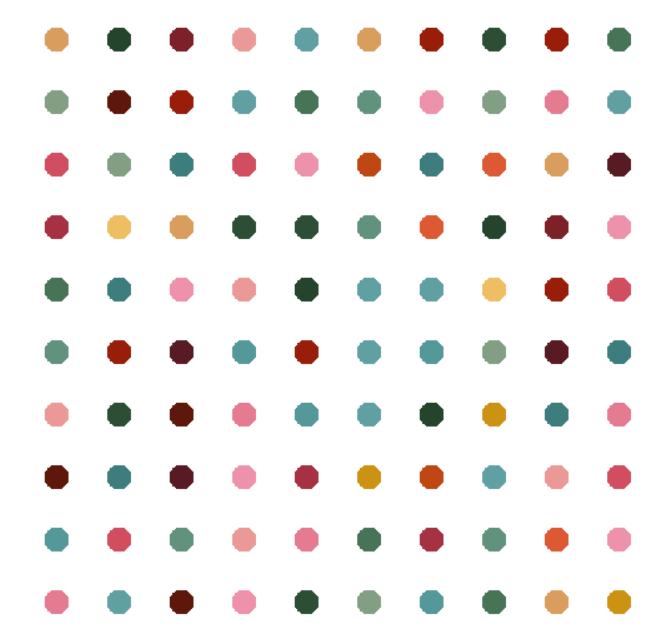

# 🎨 Dot Painting Generator 

This project is a little **dot painting generator** built using Python's `turtle` graphics library. Inspired by abstract pop-art styles (like Damien Hirst's dot paintings), it generates a grid of randomly colored dots to create a colorful digital artwork.




> 📹 A short [**demo video**](demo.mp4) is also included in the repository.

<video src="demo.mp4" controls width="600"></video>

---

## 🛠 

- Generates a grid of evenly spaced colored dots
- Uses `turtle` module for drawing
- Color palette extracted

---

## 📂 How to Run

Make sure you have Python installed.

```bash
git clone https://github.com/yourusername/dot-painting-generator.git
cd dot-painting-generator
python dot-painting-gen.py
